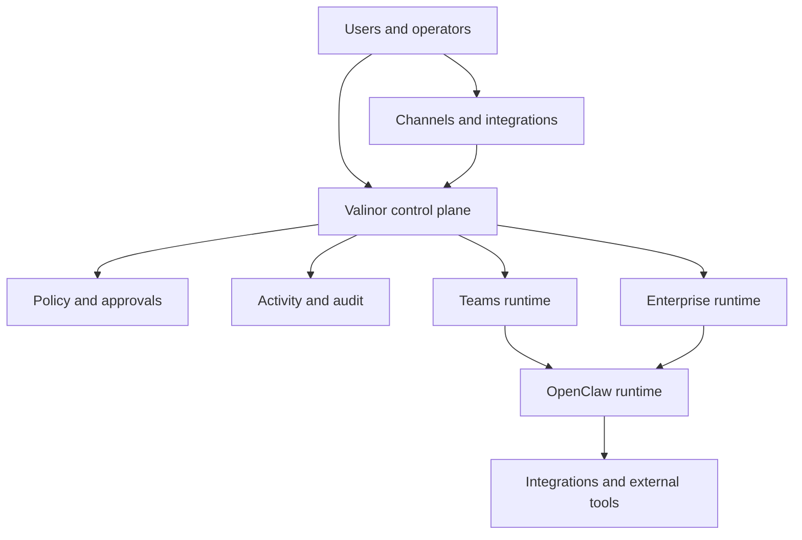

# Valinor Architecture

## Overview

Valinor is the security, observability, and governance layer above the agent runtime.

It is designed for broad-access AI agents: agents that can read real data, call real tools, message real users, and take real actions across connected systems. The runtime matters, but the durable architectural value is whether those agents can be isolated, governed, observed, and audited well enough for serious teams to trust them.

Valinor is OpenClaw-first today. Over time, the trust layer should remain runtime-extensible, but the current system is intentionally shaped around making agents like OpenClaw safe for real teams and enterprises.

## Core Components

Valinor is organized around a few core layers:

- **Control plane**
  Owns tenancy, users, departments, roles, policy defaults, approvals, channels, connectors, and runtime orchestration.
- **Proxy**
  Mediates requests into the runtime, performs ingress checks, correlates events, and persists activity and audit records.
- **Runtime**
  Runs `valinor-agent` plus the OpenClaw runtime inside an isolated execution environment.
- **Channels**
  Handle inbound and outbound delivery across Slack, WhatsApp, Telegram, and related systems.
- **Connectors**
  Register and govern external tools and systems agents can interact with.
- **Policy and approvals**
  Decide what agents can do automatically, what must be blocked, and what requires human review.
- **Activity and audit ledgers**
  Record what agents did and what organizations need to prove happened.

## Runtime Model

Valinor is OpenClaw-first today.

That means:

- the primary runtime contract is built around OpenClaw plus `valinor-agent`
- the trust surfaces are designed to sit above the runtime, not replace it
- runtime-extensible support can come later, once the runtime contract, policy model, observability model, and support model are mature enough

The runtime layer supports two product tiers:

- **Teams**
  Docker containers for straightforward deployment and container-level isolation
- **Enterprise**
  Firecracker microVMs for hardware-virtualized isolation with a separate kernel per agent

## Isolation Model

Valinor is designed around explicit trust boundaries.

The main isolation layers are:

- **Tenant isolation**
  Separate customers should not be able to observe or affect one another.
- **Department isolation**
  Teams inside a tenant can have distinct scopes, policies, and shared knowledge boundaries.
- **Per-user agent boundaries**
  Individual users can have their own agents, state, and scoped access.
- **Layered memory**
  Personal, department, tenant, and approved shared memory scopes can coexist without collapsing into one flat context pool.
- **Tenant-scoped credentials**
  Provider credentials and related secrets are scoped to the owning tenant and handled separately from other tenants.
- **Runtime isolation**
  Agents run in isolated execution environments, not a shared monolithic runtime.
- **Database isolation**
  Row-level security and tenant-aware data access reinforce the application-layer boundaries.

These layers are meant to work together. No single mechanism is the whole boundary.

## Security Model

Valinor secures agents across ingress, execution, and egress.

- **Ingress**
  Messages and requests are checked before they reach the runtime, including prompt-injection and instruction-override defenses.
- **Execution**
  Tool allow-lists, runtime restrictions, network controls, and policy evaluation govern what the agent is allowed to do while it is running.
- **Egress**
  Outbound behavior can be reviewed, blocked, or audited before it reaches users or connected systems.

The system uses hybrid enforcement:

- checks close to the runtime for model output and tool-result safety
- control-plane checks for outbound delivery, approvals, policy visibility, and centralized governance

This is designed to make high-access agents safer without reducing everything to a single checkpoint product.

## Event and Ledger Model

Valinor keeps two complementary ledgers:

- **`agent_activity_events`**
  The operator truth layer. This captures the behavior story: prompts, runtime events, tool activity, approvals, channel delivery, security findings, and outcomes.
- **`audit_events`**
  The compliance ledger. This records security-sensitive and administrative actions that organizations need for review, accountability, and investigation.

These ledgers are intentionally different:

- `agent_activity_events` help operators understand what happened
- `audit_events` help organizations prove what happened

Both are important. One is not a replacement for the other.

## Channels and Integrations

Valinor is built for agents that operate in real workflows, not just in a sandbox.

That means the architecture includes:

- inbound and outbound channel delivery
- retries and delivery visibility
- tenant-scoped provider credentials
- connector registration and governed tool access
- approval-gated connector writes that pause before external execution
- resumable governed connector actions after approval
- visibility into delivery failures, blocked actions, and external effects

Channels and integrations are not bolt-ons. They are part of the trust model because they are where agents reach real people and real systems.

## Product Tiers

Valinor currently supports two product tiers:

| | Teams | Enterprise |
| --- | --- | --- |
| **Runtime** | Docker containers | Firecracker MicroVMs (separate kernel per agent) |
| **Cold start** | 2-5 seconds | ~125 milliseconds |
| **Isolation** | Container-level | Hardware-virtualized |
| **Target** | Dev teams, small orgs | Regulated industries, high-trust environments |

Both tiers share the same governance, visibility, audit, channel, and connector model.

## What Valinor Does Not Try to Own

Valinor does not try to own every layer of the agent experience.

In particular, it should not primarily compete on:

- OpenClaw's own session-centric runtime UX
- low-level provider and model configuration UX that belongs inside the runtime
- narrow runtime-only workflows that do not materially change trust, governance, or visibility

The architectural goal is not to replace the runtime. It is to make the runtime safe, governable, and observable enough for real teams and enterprises to trust.
